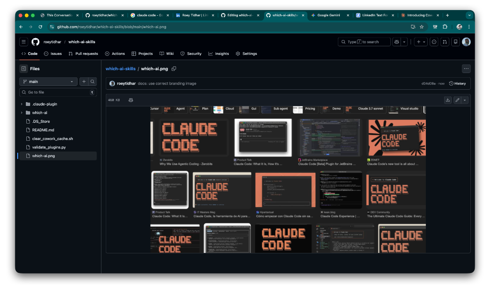

  

# Which AI 🤖

**Stop guessing which AI model to use.**

The biggest bottleneck in building real AI systems today isn't just the brain. It is the choice. There are hundreds of LLMs and one of the biggest pains is trying to choose the right one without having to be a technical expert in every single benchmark.

If you’re still hardcoding “model-name” into your code, your system is likely already outdated.

---

## Use Cases 💡

- **Dynamic Agent Orchestration**: Automatically route tasks to the most cost-effective or highest intelligence model at runtime.
- **Hardware-Aware Local Deployment**: Ensure local models only run if the system has sufficient RAM and power.
- **Real-Time Benchmarking**: Pull live Elo scores and pricing data to ensure your system always uses the current "best-in-class" model.
- **Automated Agent Generation**: A mandatory requirement for systems that spin up new autonomous agents on the fly.

---

## Key Features ⚙️

| Feature | Description | Real-Time Data Source |
| :--- | :--- | :--- |
| **Hardware Scanning** | Verifies local RAM and power availability for model compatibility. | System Context |
| **Performance Metrics** | Pulls live intelligence (Elo) scores for accuracy matching. | LMBMT / Community |
| **Cost Optimization** | Filters and selects models based on real-time input/output pricing. | OpenRouter API |
| **Intent-Based Routing** | Matches model modality (Coding, Vision, Logic) to task intent. | Skill Heuristics |

---

## Data Origin & Costs 📊

Which AI is designed to be a Zero-Cost decision primitive.

- **OpenRouter (Public API)**: Provides real-time model pricing, context length, and architecture metadata. No API key required for metadata access.
- **Artificial Analysis (GitHub Mirror)**: Provides verified LMSYS Elo scores for accurate intelligence matching.
- **Resource Requirements**: $0. All data is fetched via public, unauthenticated GET requests. 

*Note: While Which AI is free to use, the AI models it recommends may have their own execution costs depending on your provider.*

---

## IT / ISD Compliance & FAQ 🛡️

Designed with enterprise security standards in mind, Which AI is optimized for approval by Information Security Departments (ISD).

**Q: Does this skill transmit user prompts or sensitive data?**
> **A:** No. Which AI only fetches model metadata. It never accesses or transmits the content of your conversations or internal data.

**Q: Are any API keys or credentials stored by this skill?**
> **A:** No. All data fetching is performed via public, unauthenticated HTTPS GET requests. No secrets are required or stored.

**Q: What are the network dependencies?**
> **A:** The skill makes outbound HTTPS requests to `openrouter.ai` and `raw.githubusercontent.com`. No other external connections are made.

**Q: Does it require administrative or root privileges?**
> **A:** No. It runs entirely in the user-space context of the agent (Claude Code, OpenCode, or CoWork).

**Q: Is there any persistent local storage?**
> **A:** No. The skill operates in-memory and only uses local system context (RAM/Power) for real-time hardware matching.

---

## Installation & Integration 🚀

### Claude Code & OpenCode
This skill is designed as an atomic, tool-calling primitive.
1. Clone the repository.
2. Copy the `which-ai` folder into your project's skills directory.
3. Ensure your agent has permission to execute bash/python scripts.

### Claude CoWork
Which AI is a first-class Claude CoWork plugin.
1. Open **Claude CoWork**.
2. Click the `+` icon in the **Browse plugins** menu.
3. Select **Add marketplace from GitHub**.
4. Sync `roeytidhar/which-ai-skills`.
5. Install the **Which AI** card.

---

## How it Works 🧠

Which AI acts as a **Real-Time Decision Primitive**. When queried, it bypasses the "static choice" bottleneck by decoupling the decision layer from the execution layer.

1. **Query:** Agent sends parameters (budget, modality, target environment).
2. **Scan:** Which AI fetches live marketplace data and scans local system resources.
3. **Route:** The skill returns the optimal model ID, allowing the agent to proceed with the best possible context.

---

## Contributing 🤝

This is the first of many skills building towards simplified agentic systems. We welcome contributions that add new data sources or platform integrations.

[GitHub Repository](https://github.com/roeytidhar/which-ai-skills)

#AI #AgenticSystems #OpenSource #LLMOps #Claude #WhichAI #Engineering
